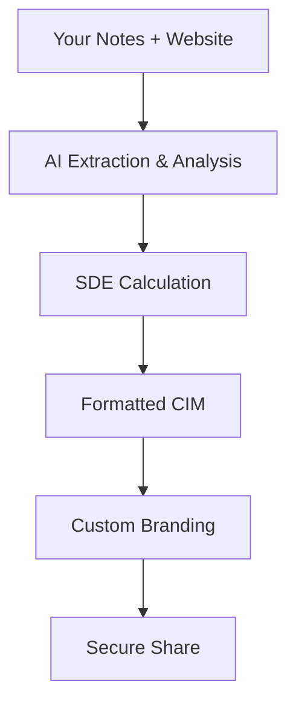

## Overview

Cimshare empowers brokers and advisors to create professional Confidential Information Memorandums (CIMs) in minutes using AI automation. You provide your notes and the business website, and Cimshare generates a complete CIM with financial analysis, SDE breakdowns, and customizable branding. Share securely via custom URLs or eSignatures while integrating with your CRM.

<Columns cols={3}>
  <Card title="AI-Powered Creation" icon="zap" href="/docs/quickstart">
    Generate CIMs automatically from notes and websites.
  </Card>
  <Card title="Secure Sharing" icon="shield" href="/docs/sharing">
    Password protection and custom links for clients.
  </Card>
  <Card title="eSignatures & CRM" icon="users" href="/docs/integrations">
    Built-in signing and CRM sync for seamless workflows.
  </Card>
</Columns>

## Key Benefits

You save hours on manual CIM drafting. Cimshare handles layout, data extraction from websites, and SDE analysis. Customize with your branding and track client interactions.

<Callout kind="success">
  Brokers report 80% faster deal preparation with Cimshare.
</Callout>

<Tabs>
  <Tab title="Brokers" icon="users">
    Focus on deals while AI builds CIMs with accurate financials.
  </Tab>
  <Tab title="Advisors" icon="book-open">
    Streamline M&A processes with eSignatures and CRM integration.
  </Tab>
</Tabs>

## How AI Automates CIM Creation

Follow these steps to create your first CIM:

<Steps>
  <Step title="Input Data" icon="edit-3">
    Enter your notes and the target business website URL.
  </Step>
  <Step title="AI Generation" icon="zap">
    Cimshare extracts data, performs SDE analysis, and formats the CIM.
  </Step>
  <Step title="Customize & Share" icon="share-2">
    Add branding, set password, and send via custom link or email.
  </Step>
</Steps>

Here's a simple API example to generate a CIM programmatically:

<CodeGroup tabs="JavaScript,Python">
  ```javascript
  const cimshare = require('cimshare-sdk');

  async function createCIM() {
    const cim = await cimshare.create({
      notes: "Strong revenue growth, key clients include Fortune 500.",
      website: "https://examplebusiness.com",
      branding: { logo: "https://yourlogo.com/logo.png" }
    });
    console.log(`CIM URL: ${cim.shareUrl}`);
  }
  ```
  ```python
  import cimshare

  cim = cimshare.create(
      notes="Strong revenue growth, key clients include Fortune 500.",
      website="https://examplebusiness.com",
      branding={"logo": "https://yourlogo.com/logo.png"}
  )
  print(f"CIM URL: {cim.share_url}")
  ```
</CodeGroup>



## Security and Affordability

Cimshare prioritizes data protection with AES-256 encryption, password-protected links, and audit logs. No long-term contracts—start at `{<span>$</span>}29` per month per user.

<ExpandableGroup>
  <Expandable title="Pricing Tiers" default-open="true">
    
| Tier     | Price      | Features                          |
|----------|------------|-----------------------------------|
| Starter  | `{<span>$</span>}29/mo` | 10 CIMs, basic sharing            |
| Pro      | `{<span>$</span>}79/mo` | Unlimited CIMs, eSignatures, CRM  |
| Enterprise | Custom   | White-label, API access           |

  </Expandable>
  <Expandable title="Security Features">
    - Password protection on all shares
    - eSignature compliance (ESIGN Act)
    - SOC 2 Type II certified infrastructure
  </Expandable>
</ExpandableGroup>

<Callout kind="tip">
  Integrate with your CRM via webhooks for automatic deal updates.
</Callout>