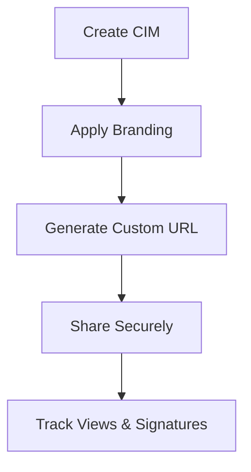

## Overview

Cimshare empowers brokers and advisors with powerful tools to create, share, and manage Confidential Information Memorandums (CIMs). You input notes and a business website, and AI generates professional CIMs. Key features include secure eSignatures, automated SDE analysis, built-in CRM, and customizable branding for seamless client sharing.

<Columns cols="3">
  <Card title="eSignatures" href="/docs/esignatures" icon="edit-3" horizontal="false">
    Collect legally binding approvals with one-click workflows.
  </Card>

  <Card title="SDE Analysis" href="/docs/sde-tools" icon="bar-chart-3" horizontal="false">
    Automate Seller's Discretionary Earnings calculations instantly.
  </Card>

  <Card title="CRM Integration" href="/docs/crm" icon="users" horizontal="false">
    Track leads and deals directly within your CIM platform.
  </Card>

  <Card title="Webhooks" href="/webhooks" icon="lucide-webhook" horizontal="false" target="_self">
    Card description...
  </Card>
</Columns>

## eSignatures and Approvals

Streamline deal approvals with integrated eSignatures. Clients review and sign CIMs securely without leaving the platform. Cimshare supports multi-party approvals and audit trails.

<Steps>
  <Step title="Upload CIM" icon="upload" title-type="p">
    Share your generated CIM via custom URL.
  </Step>

  <Step title="Request Signature" icon="edit-3" title-type="p">
    Add signers and set expiration dates.
  </Step>

  <Step title="Track Status" icon="check-circle" title-type="p">
    Monitor progress with real-time notifications.
  </Step>
</Steps>

<Callout kind="tip" collapsed="false">
  Enable `requireApproval` in your project settings for mandatory reviews before sharing.
</Callout>

## SDE Analysis Tools

Perform accurate Seller's Discretionary Earnings (SDE) analysis with AI-powered tools. Upload financials, and Cimshare computes add-backs, normalizations, and valuations automatically.

<Tabs>
  <Tab title="Quick Analysis" icon="zap">
    ```javascript
    const analysis = await cimshare.analyzeSDE({
      financials: financialData,
      addBacks: [12000, 15000] // Owner perks
    });
    console.log(analysis.sde); // e.g., 450000
    ```
  </Tab>

  <Tab title="Advanced Config" icon="settings">
    ```javascript
    const config = {
      normalizeExpenses: true,
      valuationMultiple: 4.2,
      growthRate: 0.15
    };
    const result = await cimshare.sdeReport(financials, config);
    ```
  </Tab>
</Tabs>

## CRM Capabilities

Manage your entire pipeline within Cimshare. Track CIM views, signature status, and follow-ups. Integrate with existing tools for seamless data sync.

| Feature       | Description                 | Benefit                  |
| ------------- | --------------------------- | ------------------------ |
| Lead Tracking | Auto-capture viewer details | Prioritize hot prospects |
| Deal Stages   | Custom pipelines            | Visualize progress       |
| Reminders     | Automated follow-ups        | Never miss a deal        |

<Expandable title="Advanced CRM API Integration" default-open="false">
  Connect via REST API:

  ````jsx
  <CodeGroup tabs="JavaScript,Python">
  ```javascript
  const crm = await cimshare.crm.createLead({
    email: "client@example.com",
    cimId: "cim_123",
    stage: "review"
  });
  ```
  ```python
  import cimshare
  lead = cimshare.CRM.create_lead(
      email="client@example.com",
      cim_id="cim_123",
      stage="review"
  )
  ```
  </CodeGroup>
  ````
</Expandable>

## Customizable Branding and Sharing

Tailor CIMs with your logo, colors, and domains. Share via password-protected links or embedded viewers.



<Callout kind="success" collapsed="false">
  Use brand color `#ed8769` for accents to match your firm's identity.
</Callout>

Customize in dashboard:

```javascript
cimshare.branding.update({
  logoUrl: "https://yourfirm.com/logo.png",
  primaryColor: "#ed8769",
  customDomain: "deals.yourfirm.com"
});
```

These features make Cimshare your all-in-one solution for efficient CIM workflows.
