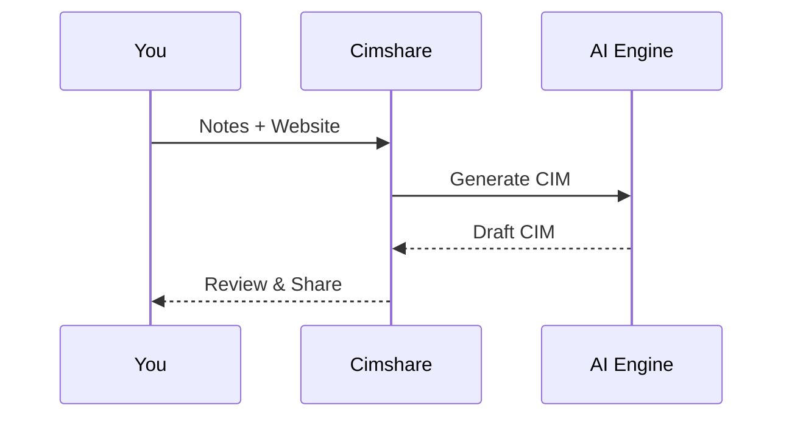

## Get Started in Minutes

Cimshare lets you create professional Confidential Information Memorandums (CIMs) using AI. Provide your notes and a business website, and the platform generates a complete CIM with eSignatures, SDE analysis, and CRM integration. Follow these steps to set up your account and produce your first document.

<Callout kind="tip">
  You can complete this quickstart in under 5 minutes. No credit card required for the trial.
</Callout>

## Create Your Account

Begin by registering for a free account.

<Steps>
  <Step title="Visit Cimshare" icon="globe">
    Go to [cimshare.com](https://cimshare.com) and click **Sign Up**.
  </Step>

  <Tabs default-tab="1">
    <Tab title="Email" icon="mail">
      Enter your email address, create a password, and verify your account via the confirmation link.
    </Tab>
    <Tab title="Google" icon="google">
      Click **Continue with Google** and authorize access to your account.
    </Tab>
  </Tabs>

  <Step title="Log In" icon="log-in">
    Return to the login page and enter your credentials. You'll land on the dashboard.
  </Step>
</Steps>

## Configure Initial Settings

Customize your profile for branded CIMs.

<Steps>
  <Step title="Upload Logo" icon="upload">
    Navigate to **Profile > Branding** and upload your company logo (PNG or SVG, `<300KB`).
  </Step>
  <Step title="Set Defaults" icon="settings">
    Choose your color scheme (`#ed8769` recommended) and default eSignature provider.
  </Step>
</Steps>

## Generate Your First CIM

Create a CIM for a sample business.

<Steps>
  <Step title="Start New CIM" icon="plus">
    Click **New CIM** on the dashboard.
  </Step>
  <Step title="Enter Details">
    Input notes like:

    ```
    TechStartup Inc. offers SaaS for small businesses. Revenue: $2M ARR. Team: 15 engineers. Seeking $10M Series A.
    ```

    Paste website: `https://techstartup.com`
  </Step>
  <Step title="Review and Generate" icon="zap">
    Click **Generate with AI**. Review the auto-generated sections: executive summary, financials, and SDE analysis.
  </Step>
  <Step title="Add eSignature" icon="edit-3">
    Enable eSignatures and send to `client@example.com`.
  </Step>
</Steps>



## Dashboard Navigation

Access key areas from the main dashboard.

<Columns cols={3}>
  <Card title="My CIMs" icon="file-text" href="/dashboard/cims">
    View, edit, and track shared documents.
  </Card>
  <Card title="CRM" icon="users" href="/crm">
    Manage clients and deal pipelines.
  </Card>
  <Card title="Analytics" icon="bar-chart-3" href="/analytics">
    Monitor CIM views and engagement.
  </Card>
</Columns>

## Share Securely

Protect your CIMs with passwords and custom URLs.

<Expandable title="Embed CIM in Your Site" default-open="false">
  Use this iframe code:

  <CodeGroup tabs="HTML,React">
  ```html
  <iframe src="https://cimshare.com/embed/cim/abc123" width="100%" height="800px" frameborder="0"></iframe>
  ```
  ```jsx
  <iframe
    src={`https://cimshare.com/embed/cim/${cimId}`}
    width="100%"
    height="800"
    frameBorder="0"
    title="CIM Preview"
  />
  ```
  </CodeGroup>
</Expandable>

<Callout kind="info">
  All shares include password protection and view tracking. Custom domains available in Pro plans.
</Callout>

Your first CIM is ready! Explore CRM integration next for full workflow automation.